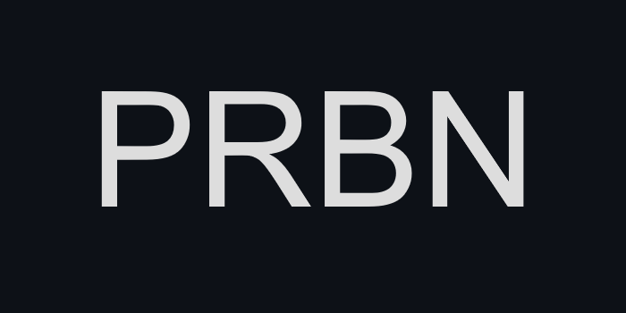

<div align="center">  

    
    
</div>

---

<h3 align="center">
    Pokémon Radio Broadcasting Network
</h3>

<p align="center">Listen to Pokémon games soundtracks with this custom minimalist audio player</p>  
<div align="center">
  <a href="https://prbn.netlify.app/">LIVE VERSION</a>  
</div>  

<details open="open">  
  <summary>Table of contents</summary>

1.  [Roadmap](#roadmap)
2.  [Description](#description)
3.  [Technologies](#technologies)
4.  [Installation](#installation)

</details>

<h2 id="roadmap">Roadmap</h2>  

✅Listen to Gen 1 and Gen 2 soundtracks  
✅Baiscs audio player functions : play / pause, next, previous, move 10 seconds forward / backward  
✅Use the slider to move forward and backward in the track  
✅Automatically goes to the next track and starts playing it when the current track is ended  
✅Multiple filter choice : listen to every tracks or select a game  
✅Spinning CD animation with a different cover for every generation  
✅Responsive

🛠Shuffle and loop functions  
🛠Move forward doesn't work  

🔜Add more generations  
🔜Make it works offline with caching

<h2 id="description">Description</h2>

<h2 id="technologies">Technologies</h2>

  
  


<h2 id="installation">Installation</h2>

To clone and run this application, you'll need Git and Node.js (which comes with npm) installed on your computer. From your command line:

#### Clone this repository
```
git clone [https://github.com/thibaudbrault/PRBN.git]
```

#### Go into the repository
``` bash
cd prbn
```

#### Install dependencies
``` bash
npm install
```

#### Run the app
``` bash
npm start
```
